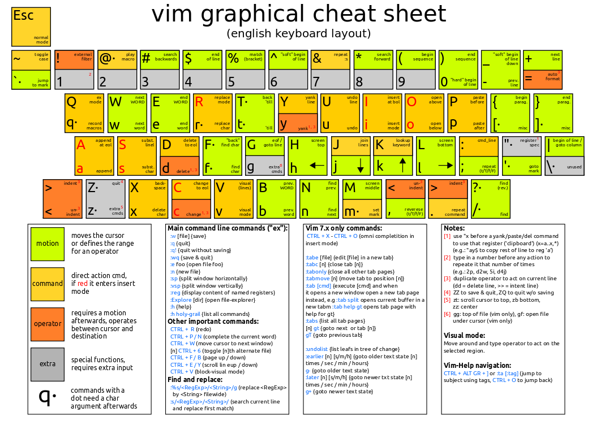

# Ecosystem Bindings

This file brings together key bindings for different tools that are used in the build,
such as Neovim, yazi, kitty, and Hyprland in one place.

<!-- toc -->

## Neovim Default Bindings

## References
